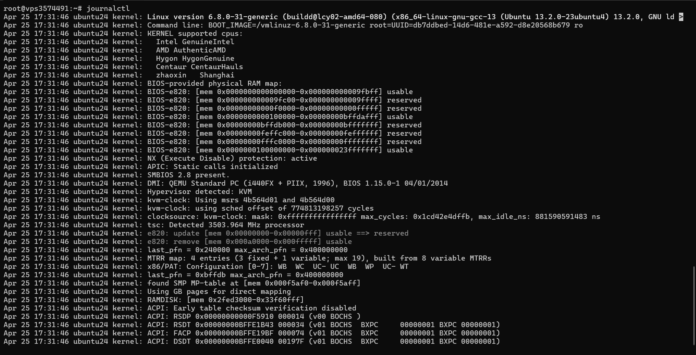

# Infrastructure & Deployment

## Practical Production Infrastructure

This section documents hands-on infrastructure work supporting AI applications, automation systems, websites, and other digital projects.

The portfolio includes evidence from Linux/VPS environments, Docker services, DNS and deployment configuration, application monitoring, analytics, and troubleshooting.

## Areas of Work

- Linux / Ubuntu server administration
- VPS environments
- Docker and containerized services
- HTTPS / certificate handling
- DNS configuration
- Application deployment
- Service status and troubleshooting
- System resource monitoring
- Logs and operational diagnostics
- Product analytics with PostHog
- Git / GitHub-based version control

## Visual Evidence

### Linux / VPS

### Docker & Services

### System Resources

### Deployment / DNS

### Product Analytics

## Security

Only sanitized evidence is published. SSH keys, passwords, API tokens, credentials, private IP addresses, database secrets, and other sensitive configuration must never be committed.