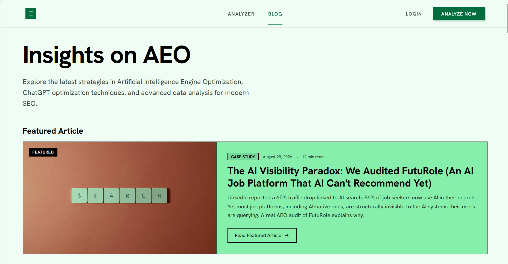

# AEOBoost

## Production SaaS for AI Search Visibility

**Live application:** https://aeoboost.app

AEOBoost is a **live, production B2B SaaS application** built for SEO professionals, marketing agencies, and digital teams working on Answer Engine Optimization (AEO) and Generative Engine Optimization (GEO).

It is a real deployed product, not a prototype or a simple demonstration. The platform includes authentication, onboarding, persistent data, analytics, AI/LLM integrations, website crawling, reporting, security controls, and production deployment infrastructure.

During its first week after launch, AEOBoost reached **approximately 30 users**.

## Product

AEOBoost helps users analyze website readiness for AI-powered search and test how brands are represented in AI-generated answers.

### Main capabilities

- Public and authenticated website auditing
- Seven-pillar AEO readiness evaluation
- Multi-model AI citation testing
- Competitor and visibility analysis
- Audit history and progress tracking
- Before/after monitoring
- Dashboard and data visualization
- AI-assisted recommendations and remediation
- Markdown and PDF reporting
- SEO/AEO content and knowledge resources

## Production Architecture

```text
User
  │
  ▼
React / TypeScript Frontend
  │
  ▼
Node.js / Express BFF
  │
  ├── Supabase / PostgreSQL
  ├── AI / LLM providers
  ├── Crawl4AI via n8n
  ├── PageSpeed Insights
  ├── Cloudflare Turnstile
  └── Product analytics
```

The production system uses React, TypeScript, Vite, Node.js/Express, Supabase/PostgreSQL, Docker, multiple AI providers, PostHog, and external APIs and services.

## Production & Operations

The product has been configured as an actual SaaS environment with supporting operational systems, including:

- User authentication and account lifecycle management
- Automated onboarding and transactional email flows
- Product analytics and event tracking with PostHog
- Website indexing and search visibility monitoring
- Google Search Console
- Git-based version control and iterative deployment
- Containerized production deployment
- Server-side API key isolation
- Rate limiting and anti-abuse protections
- SSRF protection and input validation
- Error logging and observability

The application is deployed for real users and designed to support continued growth. Resource-intensive public audits are protected by controlled concurrency and abuse-prevention mechanisms.

## My Role

I worked on the product across architecture, implementation, integrations, analytics, deployment-related configuration, testing, product iteration, and acquisition.

Key areas included:

- Full-stack application implementation
- Frontend and UX development
- Backend-for-Frontend architecture
- AI/LLM orchestration
- Database and authentication setup
- AEO evaluation logic
- API integration
- Security and abuse prevention
- Product analytics instrumentation
- Production troubleshooting and iteration

The development process was AI-assisted, with implementation decisions, integrations, testing, and documentation reviewed throughout development.

## Technology Stack

| Layer | Technologies |
| --- | --- |
| Frontend | React 18, TypeScript, Vite, Tailwind CSS, Motion, Recharts |
| Backend | Node.js, Express |
| Database & Auth | Supabase, PostgreSQL, Row-Level Security, JWT authentication |
| AI / LLM | OpenRouter, Google Gemini, Cohere, Dialogflow CX |
| Crawling & APIs | Crawl4AI, Google PageSpeed Insights, external APIs |
| Security | Cloudflare Turnstile, Helmet, rate limiting, SSRF protection |
| Analytics | PostHog |
| Infrastructure | Docker, Google Cloud Run, Git-based deployment workflow |

## Visual Evidence

### Application




### Architecture


## Technical Documentation

**Full technical overview:** [AEOBoost Technical Overview](AEOBoost-Technical-Overview.md)

The technical overview documents the application architecture, data model, AI integrations, security design, analytics, deployment, engineering challenges, and current limitations.

## Public Portfolio Scope

This repository contains public-safe documentation and visual evidence. Credentials, API keys, private infrastructure details, authentication secrets, and proprietary source code are intentionally excluded.