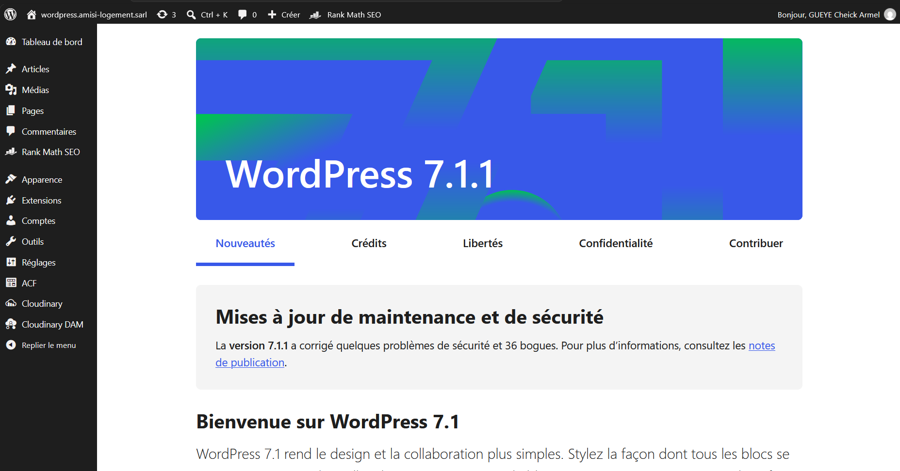

# Web Projects

## Websites & Web Interfaces

This section contains additional website and web-interface work that complements the three main projects documented in this portfolio.

## What This Section Demonstrates

- Web interface design
- Responsive page composition
- HTML/CSS/JavaScript work
- WordPress implementation
- Visual refinement and UI iteration
- Website content presentation
- Practical delivery of business-facing web projects

## Visual Evidence

Representative website screenshots are stored in `assets/web-projects/`.

Additional screenshots are available in the assets directory.

## Client Delivery

Some web work was delivered for clients rather than as standalone personal exercises. Where relevant, the portfolio emphasizes the ability to deliver a complete website and support users after delivery.

Only projects and screenshots authorized for public sharing should be included.